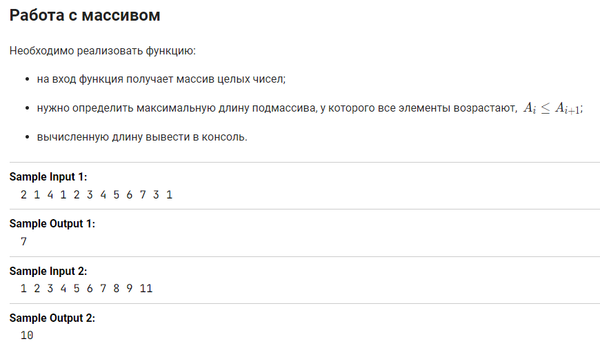
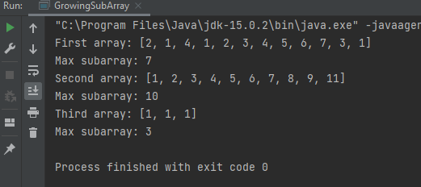

Задача из курса ["Подготовка к собеседованию Java"](https://stepik.org/course/56704") на Stepik.org.

В ходе попыток решения задачи и чтения комментариев выяснилось, что под возрастающим массивом 
имелся в виду неубывающий.

