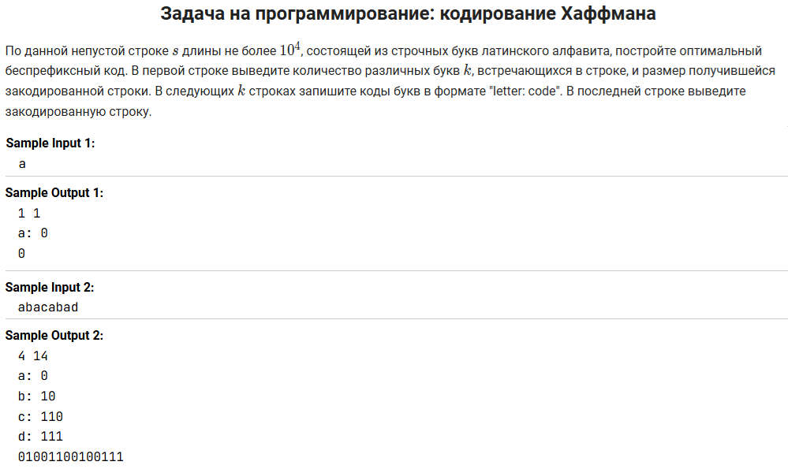
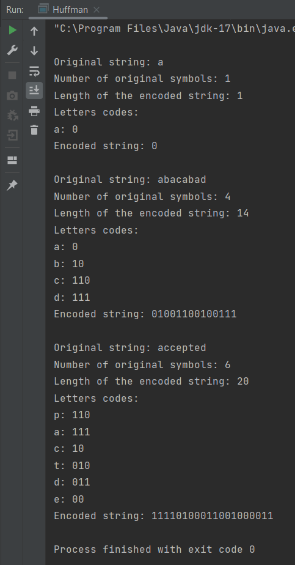

Задача из курса ["Алгоритмы: теория и практика. Методы"](https://stepik.org/course/217) на Stepik.org.

Для решения этой задачи я написала реализацию собственного класса-узла для дерева кодирования. Помимо ссылок на левый и
правый подузел, в этом классе есть поля value (кодируемый символ) и priority (количество использований символа в строке).
При построении дерева все символы хранятся только в листьях, а корень и все остальные узлы имеют значение value = null. 

Помимо строк из базовых открытых тестов ("a" и "abacabad"), я добавила проверку кодирования слова "accepted". Это слово
было одним из сложных среди закрытых тестов. При неоптимальном кодировании его размер 23 бита (то есть, закодированная
строка из 23 нулей и единиц), а при оптимальном кодировании - 20 бит.

