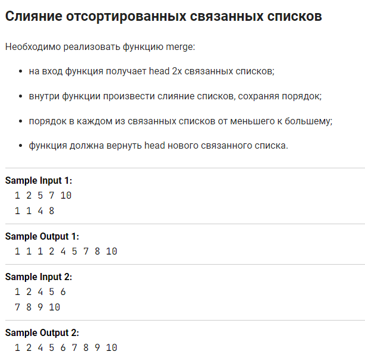
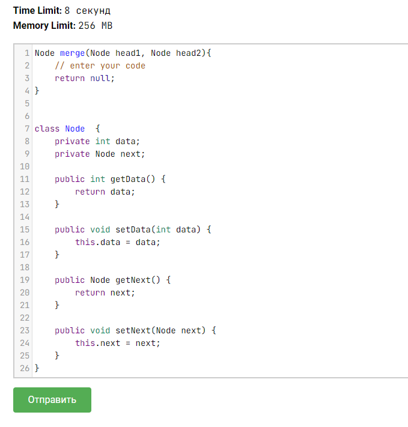
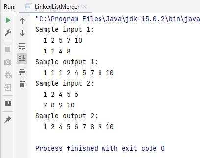

Задача из курса <a href="https://stepik.org/course/56704">"Подготовка к собеседованию Java"</a> на Stepik.org

В задании была скрыта реализация классов Node, видна только структура в качестве подсказки.

Для демонстрации решения мне пришлось немного преобразовать исходный класс:

<ol>
    <li>Чтобы получить возможность создать экземпляры Node, я добавила в класс конструктор.</li>
    <li>Чтобы получить внятный видимый результат, я переопределила toString().</li>
</ol>

