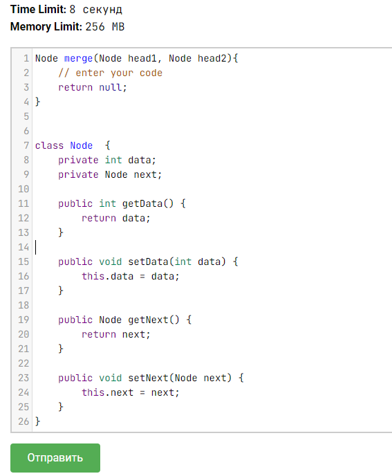

Задача из курса ["Подготовка к собеседованию Java"](https://stepik.org/course/56704) на Stepik.org.

В задании была скрыта реализация классов Node, видна только структура в качестве подсказки.

Для демонстрации решения мне пришлось немного преобразовать исходный класс:
1. Чтобы получить возможность создать экземпляры Node, я добавила в класс конструктор. 
2. Чтобы получить внятный видимый результат, я переопределила toString().

