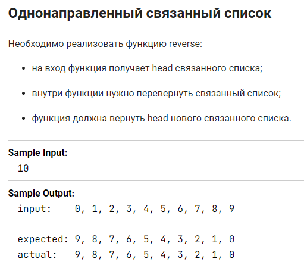
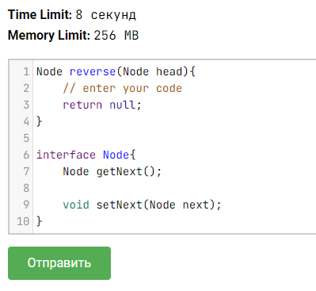
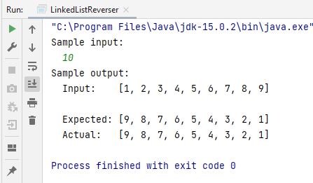

Задача из курса ["Подготовка к собеседованию Java"](https://stepik.org/course/56704") на Stepik.org.

В задании реализация односвязного списка была скрыта, в качестве подсказок были выданы сигнатура метода 
и интерфейс.

Для того, чтобы продемонстрировать решение задачи, мне потребовалось реализовать свой собственный
односвязный список.  
В этом мне помог один из уроков курса ["Продвинутая Java"](https://www.udemy.com/course/javarussia), 
преподаватель Наиль Алишев, платформа Udemy.com.

