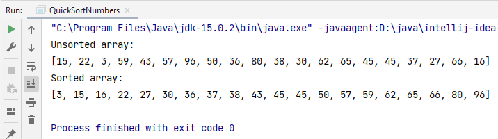

При выполнении домашнего задания на стажировке мне потребовалось изучить алгоритм работы быстрой сортировки. 
Для этого я написала код, сортирующий массив целых чисел. В качестве примера привожу сортировку массива случайных целых
чисел в диапазоне от 0 до 99 методом quicksort.

