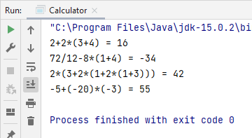

Задача из курса <a href="https://stepik.org/course/56704">"Подготовка к собеседованию Java"</a> на Stepik.org

Пока решение не очень красивое, но работает. Буду проводить code review в ближайшее время, переделаю код на работу
со switсh и StringBuilder.

Добавила выброс исключения при вводе несанкционированных символов.

<b><i>Примечание:</b> когда закончу все текущие проекты, надо будет написать исполняемый калькулятор.</i>