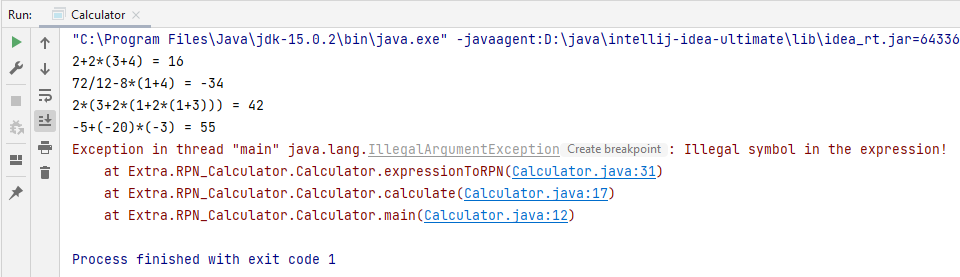

Задача из курса ["Подготовка к собеседованию Java"](https://stepik.org/course/56704") на Stepik.org.

Кроме предложенных в задании выражений, я добавила от себя ещё одно, содержащее унарные минусы. Также я предусмотрела 
случаи, когда выражение является null, или пустым, или содержит нелегальные для математического выражения
символы.

***Примечание:** когда закончу все текущие проекты, надо будет написать исполняемый калькулятор.*