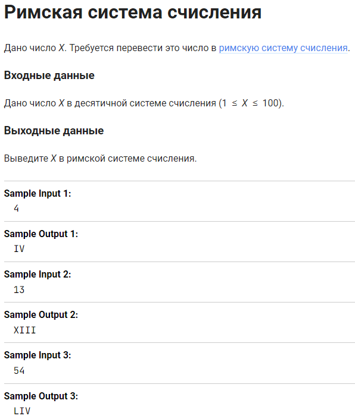
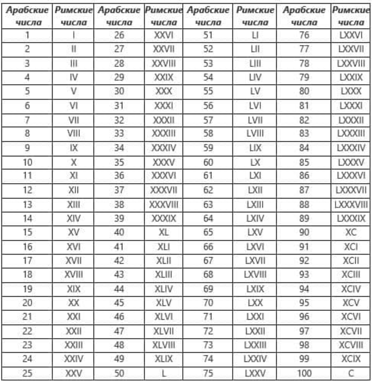
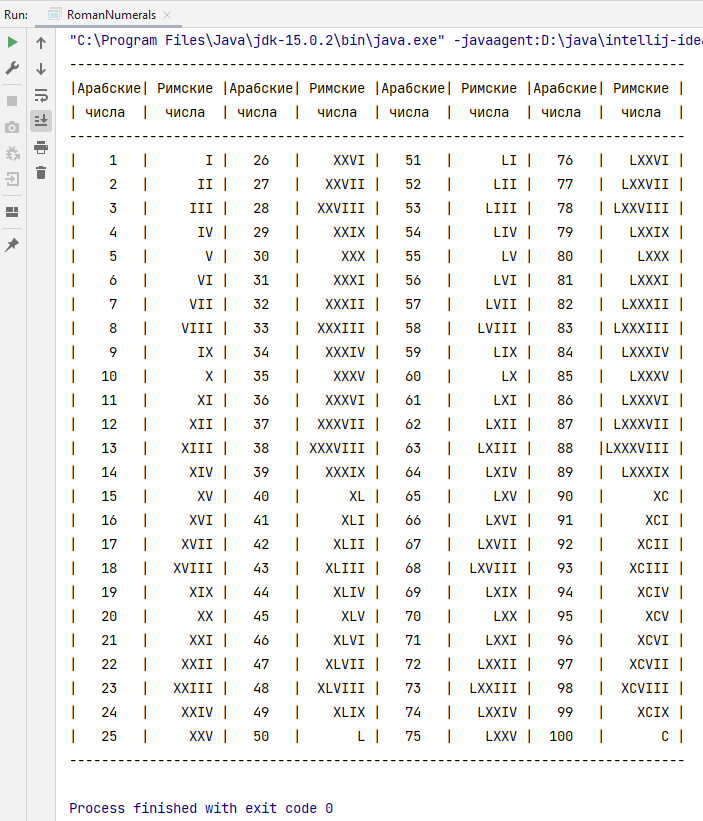

Задача из курса ["Основы Java"](https://stepik.org/course/82867) на Stepik.org.

При проверке правильности решения задачи я пользовалась таблицей, найденной на просторах Интернета:

Поэтому для демонстрации решения я при помощи длинного StringBuilder() оформила вывод похожей таблицы в консоль:

