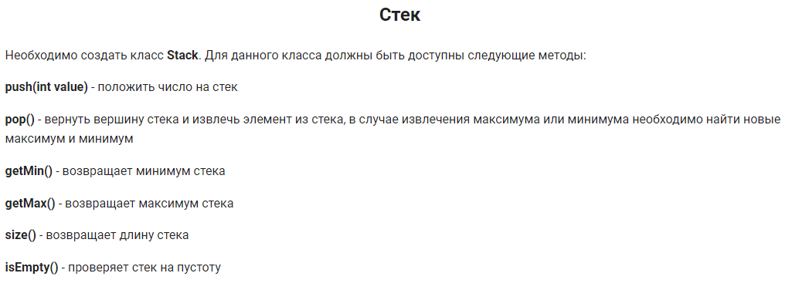
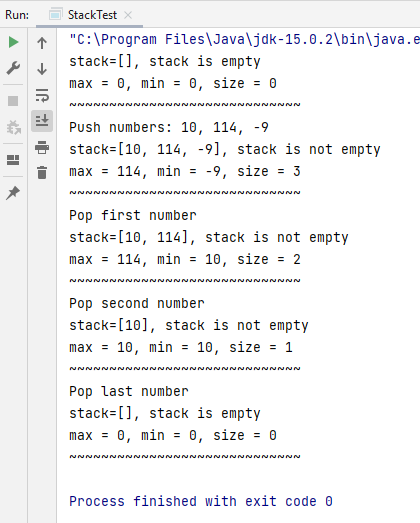

Задача из курса [Летняя Java школа](https://stepik.org/course/10498) на Stepik.org.

Вариантов решения задания было много: с помощью ArrayList, LinkedList, Queue, Deque, Stack (ну это было бы совсем уж
по-читерски :wink:), да хоть с помощью обычного массива. Я выбрала ArrayList без использования класса Collections,
чтобы посложнее.

Чтобы не возиться каждый раз с выводом всех полей стека по отдельности, и при этом задействовать все указанные
методы, я переопределила toString в подробный вывод данных.

