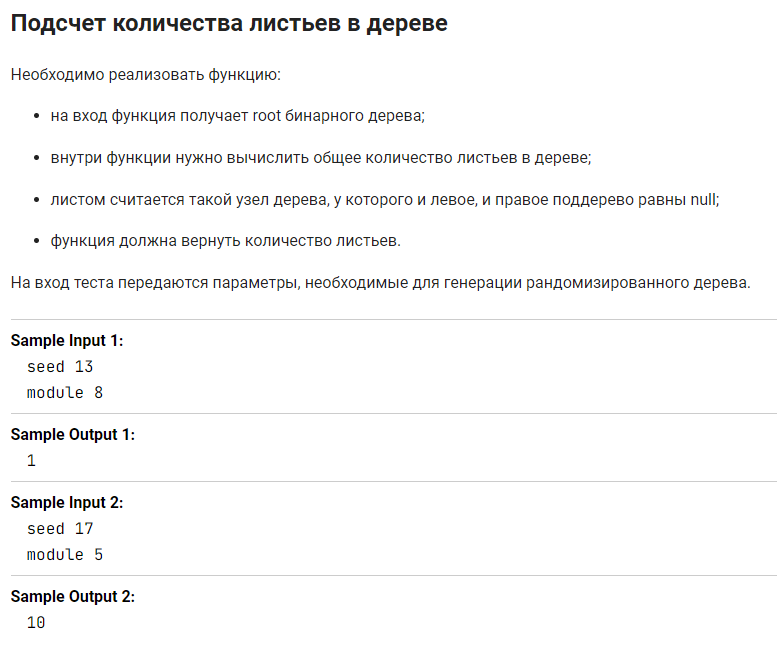

Задача из курса ["Подготовка к собеседованию Java"](https://stepik.org/course/56704") на Stepik.org.

Деревья для тестирования решения генерировались скрыто, в качестве подсказки была выдана структура узла.

Я реализовала этот класс, добавила поле value для присвоения листу значения, удалила ненужные геттеры и сеттеры.
Реализовала метод подсчёта листьев.

