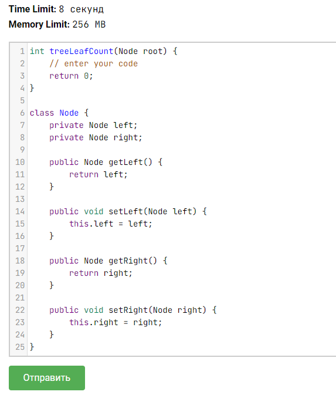
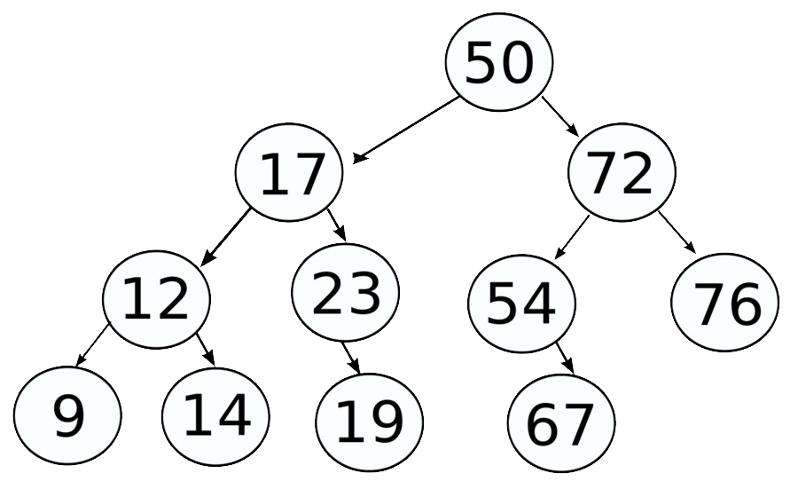
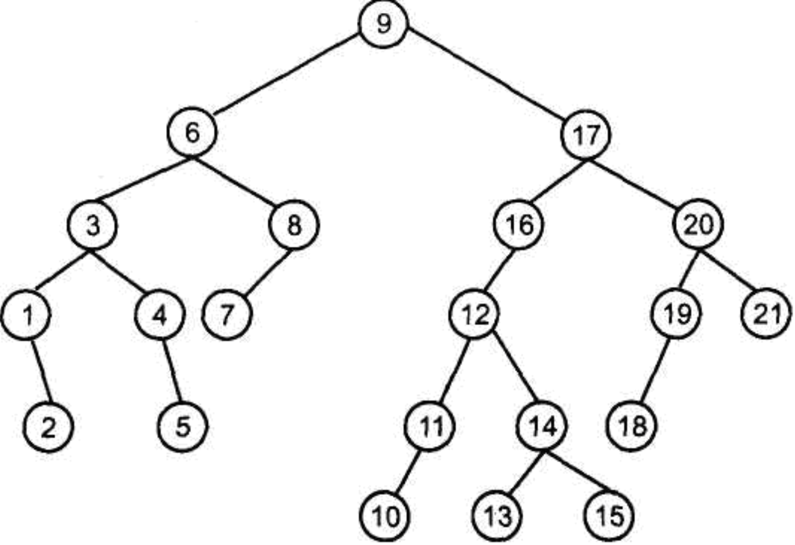
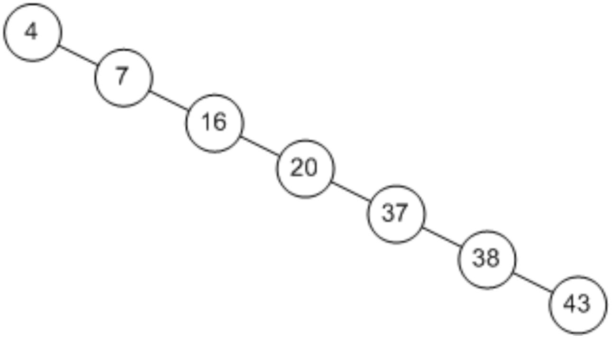
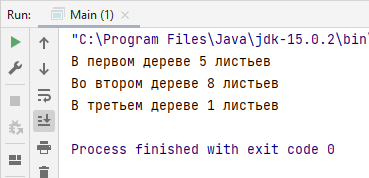

Задача из курса ["Подготовка к собеседованию Java"](https://stepik.org/course/56704) на Stepik.org.

Деревья для тестирования решения генерировались скрыто, в качестве подсказки была выдана структура узла.

Я реализовала этот класс, добавила поле value для присвоения узлу значения, удалила ненужные геттеры и сеттеры.
Реализовала метод подсчёта листьев.

Для демонстрации решения я нашла на просторах Google три дерева: одно поменьше, одно побольше, и одно вырожденное.

Визуально можно посчитать, что в первом дереве 5 листьев, во втором 8, а в третьем всего один лист.

